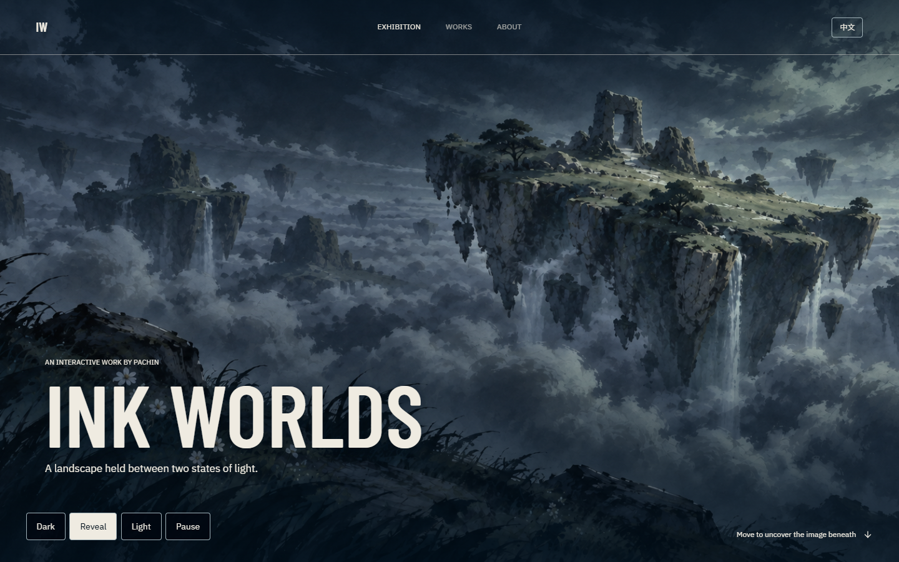
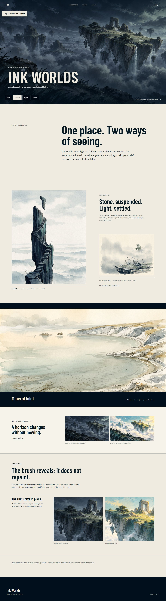

# Ink Worlds

[Live demo](https://pachin1919.github.io/ink-worlds-motion-preview/)



A bilingual gallery built around two aligned paintings. Moving through the image reveals the second world beneath the first.

## Pages

- /
- /works
- /works/two-worlds
- /about

## Run locally

```powershell
npm.cmd install
npm.cmd run dev
```

Build the static site with `npm.cmd run build`.

[Deployment](docs/GITHUB-PAGES.md) · [Asset provenance](docs/ASSETS.md) · [Third-party notices](THIRD_PARTY_NOTICES.md)

A visual concept, not a commercial product or service. Original artwork and code are not offered under a general open-source license. Font and dependency licenses are retained separately.


