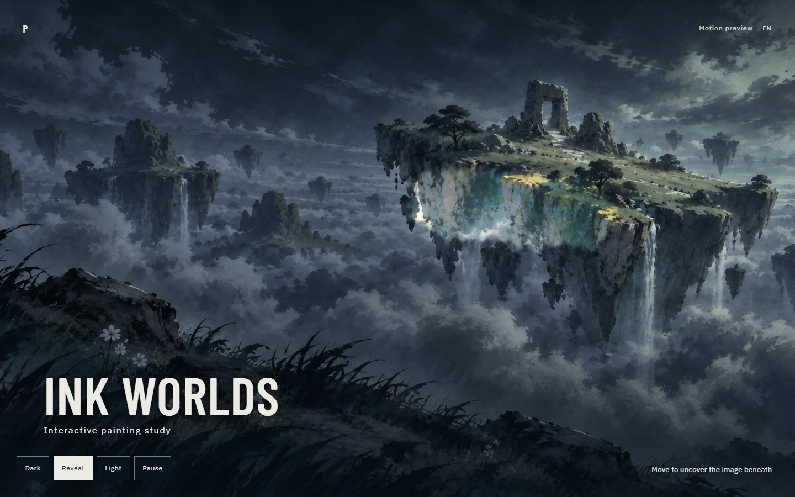

# Ink Worlds — Motion Preview

A standalone, static preview of a two-layer interactive painting. [View the live demo](https://pachin1919.github.io/ink-worlds-motion-preview/).



The darker painting sits above an aligned lighter version. Moving the pointer or dragging on touch temporarily erases the upper layer's mask to reveal the image beneath. Use **Dark** and **Light** to inspect each original image, **Reveal** to return to the interaction, and **Pause** to stop mask decay. Keyboard users can focus the painting and use the arrow keys. Reduced-motion mode shows the still layers instead.

This public preview uses the study title in place of personal details. The English-only language control is retained as an interface placeholder; it does not switch languages yet.

Open `index.html` from a local web server, for example:

```powershell
python -m http.server 4328 --bind 127.0.0.1 --directory .
```

Then visit `http://127.0.0.1:4328/`. The animation pauses when the page is hidden or scrolled out of view. If canvas rendering or an image fails, the complete darker painting remains visible.

This preview requires no build step, backend, external assets, or third-party JavaScript. Font license files are included in `assets/fonts/`. The landscape artwork remains project-specific and is not offered for reuse.
